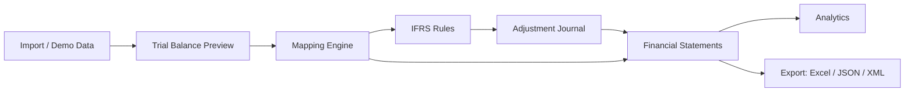

# Архитектура MSFO.Global

MSFO.Global реализован как единое Next.js App Router приложение без отдельного backend-сервиса. Для v1 это осознанное решение: весь workflow должен запускаться локально после `npm install` и `npm run dev`.

## Компоненты

- `app/` - маршруты App Router.
- `components/` - layout, UI-примитивы, страницы и отчётные компоненты.
- `lib/fixtures/` - компании, демо-ОСВ, IFRS-строки и автосопоставление.
- `lib/store/app-store.tsx` - React context и localStorage persistence.
- `lib/import/` - парсинг XLSX/CSV через SheetJS.
- `lib/mapping/` - маппинг локальных счетов на IFRS-строки.
- `lib/ifrs/` - чистые функции учебных IFRS/IAS правил.
- `lib/statements/` - генерация SOFP, P&L и Cash Flow.
- `lib/analytics/` - коэффициенты и данные для графиков.
- `lib/export/` - Excel, JSON и XML/XBRL-like экспорт.
- `tests/` - unit-тесты Vitest.

## Data Flow

## State

Состояние хранится в `localStorage` под ключом `msfo-global-state-v1`. При первом запуске приложение использует TypeScript fixtures. Кнопка «Сбросить демо-данные» возвращает состояние к исходному набору.

## Почему без backend в v1

Для образовательной демонстрации важнее показать полный workflow и расчёты. База данных, auth, RBAC, ERP-коннекторы и XBRL-валидация вынесены в roadmap.
